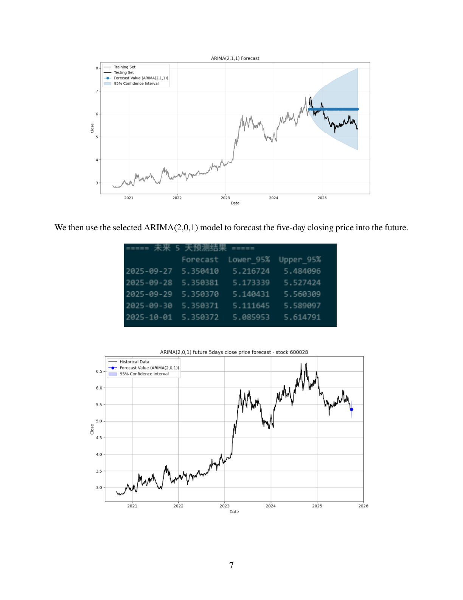

# Time Series Stock Forecasting (ARIMA/SARIMA + XGBoost)

This repository contains a small research project on **stock price forecasting** using:
- classical time-series models (**ARIMA / SARIMA**),
- benchmark “simple” forecasting rules (mean/naive/seasonal-naive/drift),
- and a **multi-horizon XGBoost** pipeline with technical indicators.

> The detailed report is in [`reports/Report.pdf`](reports/Report.pdf).  
> Figures shown below are extracted from the report for quick preview.

---

## Dataset

- Data source: **Wind** database; the stock universe comes from A50 index constituents at the acquisition date.
- Sample period: **2020-09-01 to 2025-09-26** (daily frequency, 1,232 trading days).
- Example single-stock analysis: **600028.SH** using daily close prices.
- Preprocessing: forward-fill missing values; ensure datetime index; first differencing for stationarity; **80/20** train-test split.

> See the report for details and motivation.

---

## Methods

### 1) ARIMA / SARIMA (single-stock, close price)

- Stationarity is achieved after **first differencing** (ADF/KPSS discussion in the report).
- Candidate orders are guided by ACF/PACF and information criteria (AIC/AICc/BIC).
- Seasonal attempt uses trading-week seasonality **s = 5**, but did not improve out-of-sample error on this series.

**Model selection note**: the report chooses an ARIMA model on the *stationary (differenced)* series (so statsmodels is run with `d=0` after preprocessing). This is equivalent to fitting an integrated ARIMA on levels if differencing is moved into the model.

### 2) Simple baselines (single-stock, close price)

- Mean, Naive, Seasonal-Naive (m=5), Drift.

### 3) XGBoost multi-horizon pipeline (panel data)

- Train **five independent XGBoost models** for horizons T+1 … T+5.
- Predict **forward returns**, convert back to prices for evaluation.
- Hyperparameter search: `RandomizedSearchCV` + `TimeSeriesSplit`.

---

## Quick Results Preview

### ARIMA forecast example (from the report)



### Data visualization & decomposition (from the report)


---

## Repository Structure

- `notebooks/` — notebooks for ARIMA/SARIMA, baselines, and XGBoost pipelines
- `reports/` — final report PDF
- `figures/` — figures extracted from the report for README preview
- `data/` — **not versioned** (keep only small samples under `data/sample/`)

---

## How to Run

### 1) Create environment

```bash
pip install -r requirements.txt
```

### 2) Open notebooks

```bash
jupyter lab
# then open notebooks/*.ipynb
```

> If you keep your CSV data locally, put them under `data/raw/` and update the file paths inside notebooks.

---

## Reproducibility & Data Policy

This repo intentionally does **not** upload full datasets.  
If you want to provide a tiny sample for reviewers, place it in `data/sample/` (kept by `.gitignore` rules).

---

## License

MIT. See `LICENSE`.
